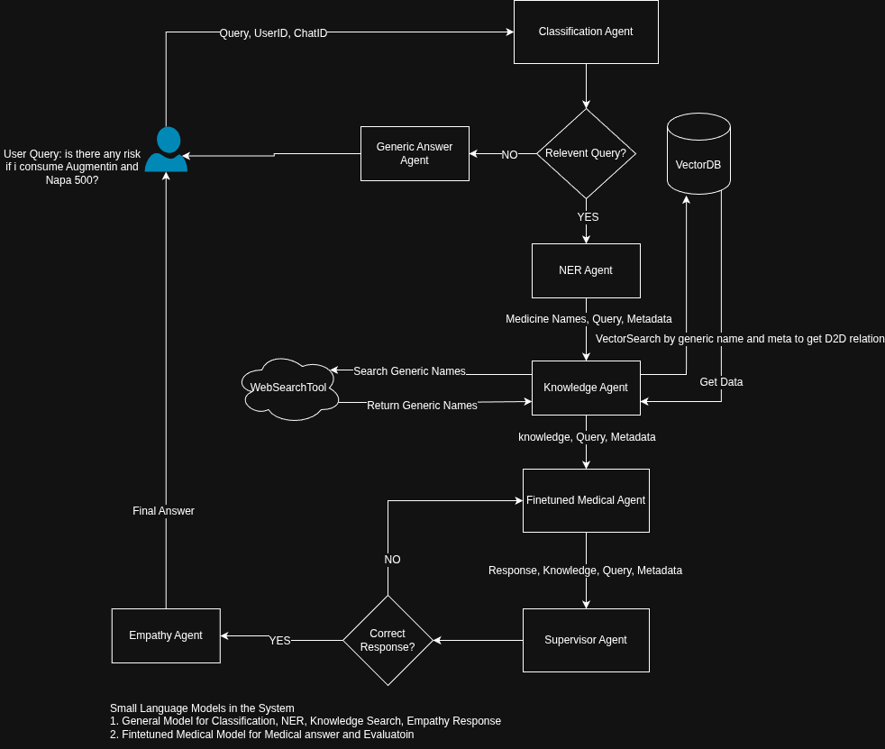

# SLMs in Multi-Agent Systems for Medication Safety

This repository explores the design and evaluation of **Small Language Model (SLM)–based multi-agent systems** for answering medication-related queries.

---

## Research Objective

The primary objectives of this research are:

- Assess how effectively **SLM-based multi-agent architectures** can answer medication-related questions safely and accurately
- Compare **multi-agent SLM systems** against **single-agent LLM chatbots** in terms of reliability, hallucination control, and safety for drug information

---

## Quick Setup (Linux - Ubuntu)

### 1. Setup Workspace
You can either install manually or use the `setup.sh` script.

#### Option 1: Manual Setup
**Note:** `git` and `uv` should be already installed in your system. Read [uv-astral installation guide](https://docs.astral.sh/uv/getting-started/installation/) for more.

```bash
git clone https://github.com/aimlcommunitybd/RP3-MedicineAgent.git
cd RP3-MedicineAgent

uv venv
uv sync
uv pip install torch torchvision --index-url https://download.pytorch.org/whl/cpu
uv pip install "transformers[torch]"
sudo apt-get install git-lfs
git lfs install
```

#### Option 2: Automated Setup
Run the setup script to perform all steps automatically. 
In case you encounter any system level error, please setup manually.

```bash
git clone https://github.com/aimlcommunitybd/RP3-MedicineAgent.git
cd RP3-MedicineAgent

bash setup.sh
```

### 2. Download Models

```bash
# Format: uv run scripts/download_model.py <hf_repo_id> <gguf_filename>

uv run scripts/download_model.py "unsloth/medgemma-4b-it-GGUF" "medgemma-4b-it-BF16.gguf"
```

### 3. Update Environment Secret
```
cp .env.example .env # Later add actual environment variables in .env
```

### 4. Run Chat Command
```bash
# Format: uv run chat.py <query>

uv run chat.py "Is it safe to take metformin and atorvastatin together?"
```

### 5. Using the RAG System

The RAG (Retrieval-Augmented Generation) system uses a vector database to find relevant drug interactions from a CSV file.

#### A. Build the Database

To create or update the vector database, run the following command. This script processes `dataset/db_drug_interactions.csv` and populates the LanceDB table.

```bash
uv run python -m src.rag.database
```

#### B. Query the Database

You can directly search the drug interaction database using the retrieval script.

```bash
# Format: uv run python -m src.rag.retrieval <query> [--limit <number_of_results>]

uv run python -m src.rag.retrieval "Cyclophosphamide and Bicalutamide effects" --limit 5
```

---

## Architecture



High-level flow:

* User queries are routed through an orchestrator
* Specialized agents (general reasoning, medical expert) collaborate
* Retrieval tools support evidence-grounded responses
* Safety-aware responses are returned to the user

---

## Project Structure

```text
.
├── chat.py                # Entry point for interactive chat
├── dataset/               # Drug–drug interaction datasets
├── resources/             # Diagrams and documentation assets
├── scripts/               # Utility scripts (model download, setup)
├── src/
│   ├── agents/            # Agent roles (general, expert)
│   ├── app/               # Orchestration logic
│   ├── engine/            # LLM tools
│   ├── models/            # Model files and metadata
│   ├── prompts/           # Prompt templates
|   ├── rag/               # rag and vector db logics
│   ├── tools/             # Vector and web search tools
│   └── settings.py        # Global configuration
└── pyproject.toml
```

---

## Models

1. MedGemma-4B (Instruction-Tuned)

* Official model: [https://deepmind.google/models/gemma/medgemma/](https://deepmind.google/models/gemma/medgemma/)
* GGUF source: [https://huggingface.co/unsloth/medgemma-4b-it-GGUF](https://huggingface.co/unsloth/medgemma-4b-it-GGUF)

---

## External Medical Knowledge Sources

Publicly accessible sources used for retrieval and reference:

* medex.com.bd
* drugs.com
* rxlist.com
* medscape.com
* medsbd.com
* farmacoinc.com
* arogga.com

> These sources are used for **informational support only**.

---

## Help
1. How to install uv?  
Answer: Please refere to [resources/pkg.md](resources/pkg.md)

## Disclaimer

This project is intended **solely for research and educational purposes**.
It is **not a medical device** and must not be used for clinical diagnosis, treatment, or decision-making.

---


